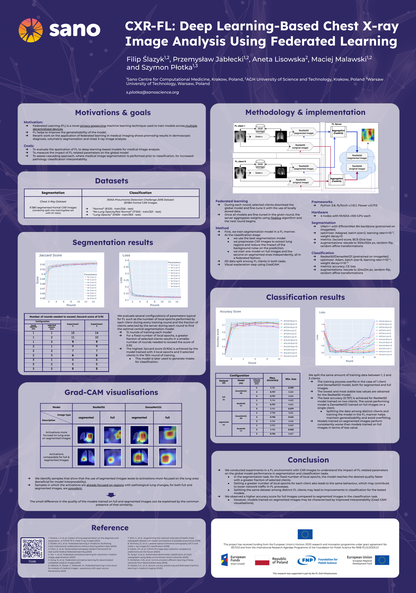

# CXR-FL

### Deep Learning-based Chest X-ray Image Analysis Using Federated Learning.

Accepted at International Conference on Computational Science (ICCS) 2022, London.

#### Authors

* [Filip Ślazyk](https://www.linkedin.com/in/filip-slazyk/)
* [Przemysław Jabłecki](https://www.linkedin.com/in/przemyslaw-jablecki/)
* [Aneta Lisowska](https://www.linkedin.com/in/anetajl/)
* [Maciej Malawski](https://www.linkedin.com/in/maciej-malawski-a39bb51/)
* [Szymon Płotka](https://www.linkedin.com/in/szymonplotka/)

#### Abstract

Federated learning enables building a shared model from multicentre data while storing the training data locally for privacy. In this paper, we present an evaluation (called CXR-FL) of deep learning-based models for chest X-ray image analysis using the federated learning method. We examine the impact of federated learning parameters on the performance of central models. Additionally, we show that classification models perform worse if trained on a region of interest reduced to segmentation of the lung compared to the full image. However, focusing training of the classification model on the lung area may result in improved pathology interpretability during inference. We also find that federated learning helps maintain model generalizability. 

Please cite our work as:

```
@misc{2204.05203,
Author = {Filip Ślazyk and Przemysław Jabłecki and Aneta Lisowska and Maciej Malawski and Szymon Płotka},
Title = {CXR-FL: Deep Learning-based Chest X-ray Image Analysis Using Federated Learning},
Year = {2022},
Eprint = {arXiv:2204.05203},
}
```

#### Poster


